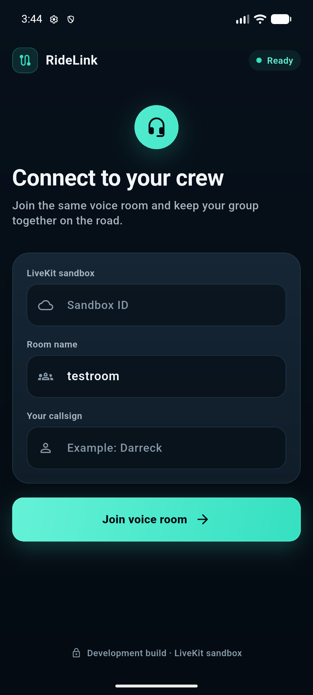
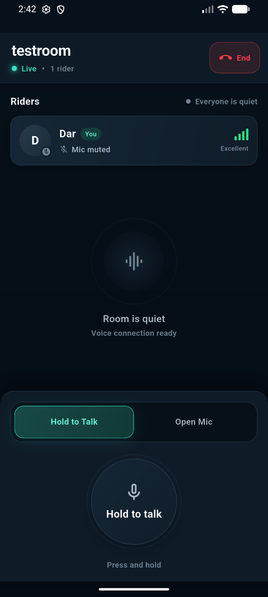
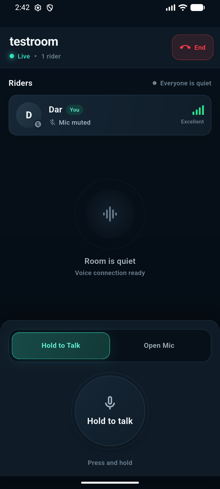

# RideLink

**A mobile group intercom built for motorcycle riders.** RideLink provides push-to-talk and open-mic voice communication over mobile data, allowing a riding group to stay connected beyond the range of traditional Bluetooth intercoms.

> **Project status: Active prototype.** The core room, voice, background-audio, and rider-status flows are working and ready for real-world ride testing. Review the [current limitations](#current-limitations) before using it as a production service.

<table>
  <tr>
    <td width="25%"></td>
    <td width="25%"></td>
    <td width="25%"></td>
    <td width="25%"></td>
  </tr>
  <tr>
    <td align="center"><sub>Connect</sub></td>
    <td align="center"><sub>Hold to Talk</sub></td>
    <td align="center"><sub>Transmitting</sub></td>
    <td align="center"><sub>Muted</sub></td>
  </tr>
</table>

---

## Highlights

- **Group voice rooms** for multiple riders instead of one-to-one calls
- **Hold to Talk and Open Mic modes** for different riding situations
- **Bluetooth headset routing** designed for helmet intercoms and headsets
- **Background audio support** through an Android foreground service
- **Live rider presence** with microphone, speaking, connection, and signal states
- **Data-conscious voice transport** with discontinuous transmission enabled during silence
- **Responsive Android UI** tested on Pixel 8 and compact 360 × 640 layouts
- **Safe-area-aware controls** with scrolling support on smaller screens

## Latest UI enhancements

- Redesigned the connect screen with a premium deep-navy visual system
- Added modern rounded form fields, clear focus states, and a responsive layout
- Rebuilt the voice room with compact rider cards and improved status hierarchy
- Added quiet-room visualization and active-transmission feedback
- Added a circular microphone control with ready, muted, connecting, disconnected, and transmitting states
- Added an animated pulse ring while transmitting
- Improved rider-name handling, multiple-rider scrolling, contrast, and touch targets
- Added clearer signal strength, microphone state, and active-speaker indicators
- Restricted red to end-call, disconnection, and danger states
- Added polished loading, error, and disconnect feedback

## Design direction

RideLink is designed for quick, glanceable use by riders wearing a helmet and gloves. The interface uses deep navy and charcoal surfaces, high-contrast typography, large touch targets, restrained technical details, and teal communication states.

| Color | Meaning |
|---|---|
| Teal | Connected, ready, or actively transmitting |
| Red | End call, disconnected, or danger |
| Gray | Quiet, muted, or inactive |

The brightest state is reserved for active transmission. A teal microphone button with a pulse ring means the rider is currently sending audio.

Shared design tokens are defined in [`lib/theme.dart`](lib/theme.dart), while reusable controls are located in [`lib/widgets.dart`](lib/widgets.dart).

## Project structure

```text
lib/
  main.dart      Connect and voice-room screens plus LiveKit integration
  theme.dart     Shared colors, typography, radii, and theme values
  widgets.dart   Reusable fields, status meters, mode switch, and PTT control
test/
  widget_test.dart
docs/screenshots/
```

## Running the app

Requirements:

- Flutter 3.47 or newer
- An Android device or emulator
- A LiveKit Cloud project and Sandbox ID for prototype testing

```bash
flutter pub get
flutter run
```

On the Connect screen, enter:

1. Your LiveKit Sandbox ID
2. A room name shared by all riders
3. A unique rider callsign

To keep the Sandbox ID outside the source code, create a local configuration file:

```bash
cp dev.example.json dev.json
flutter run --dart-define-from-file=dev.json
```

`dev.json` is ignored by Git and must never be committed. The prototype sandbox flow does not provide application-level authentication, so do not expose your Sandbox ID publicly.

## Quality checks

```bash
dart format lib test
flutter analyze
flutter test
```

The widget tests cover the connect screen validation and the primary microphone visual states.

## Building an Android APK

Universal APK:

```bash
flutter build apk --release
```

Smaller architecture-specific APKs:

```bash
flutter build apk --release --split-per-abi
```

The universal APK is easier to distribute across different Android devices. Avoid switching between universal and split APK variants on the same device when their generated version codes differ.

The current release build still uses a development signing setup and is intended for testing, not Play Store distribution.

## Current limitations

- **On-screen push-to-talk is not hands-free.** While riding, Open Mic is currently the practical option. Bluetooth media-button or handlebar-remote support is planned.
- **The app uses the LiveKit sandbox connection flow.** A production deployment needs a secure authenticated token endpoint.
- **No application authentication is implemented yet.** Room access is not suitable for public production use.
- **Connected room time still consumes service quota during silence.** Riders should end the call after every ride.
- **Voice encoding can be optimized further** for speech-focused helmet audio and lower data usage.
- **Bluetooth headset profile switching is hardware-dependent.** RideLink no longer requests exclusive Android audio focus, so media apps can keep their normal volume. However, many Bluetooth headsets must switch from stereo A2DP music to the lower-bandwidth call profile while their microphone is active.
- **Production branding and signing are pending**, including a custom launcher icon and release keystore.

## Roadmap

- [ ] Secure Laravel token endpoint with authenticated room access
- [ ] Bluetooth headset media-button support for hands-free push-to-talk
- [ ] Speech-optimized audio encoding
- [ ] Automatic idle-room disconnect to reduce quota usage
- [ ] Custom RideLink launcher icon and production signing
- [ ] Self-hosted LiveKit deployment option for larger groups
- [ ] Expanded device and real-world long-ride testing

## Technology

[Flutter](https://flutter.dev) · [LiveKit](https://livekit.io) · [WebRTC](https://webrtc.org) · [permission_handler](https://pub.dev/packages/permission_handler) · [flutter_background](https://pub.dev/packages/flutter_background)

## Safety note

Configure the app before starting a ride. Do not operate a phone or on-screen push-to-talk control while the motorcycle is moving. Use a properly mounted device and a compatible helmet headset.
