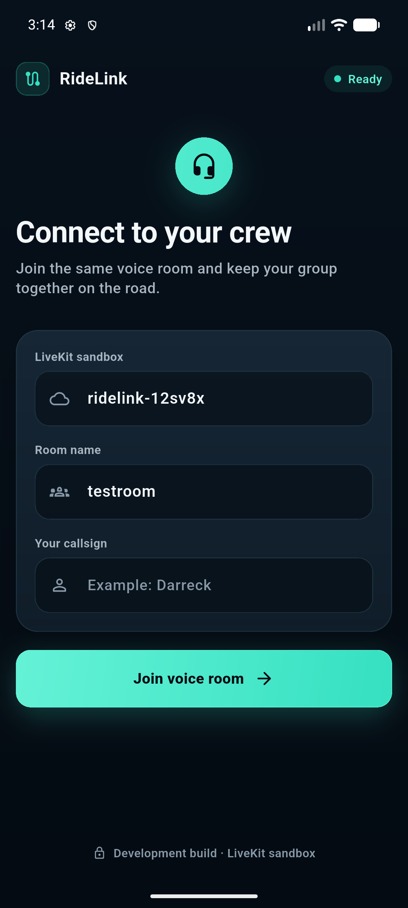
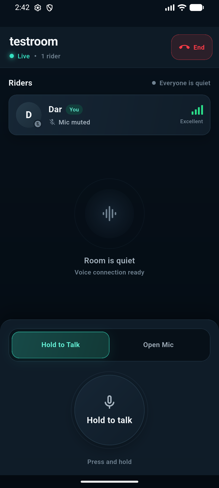
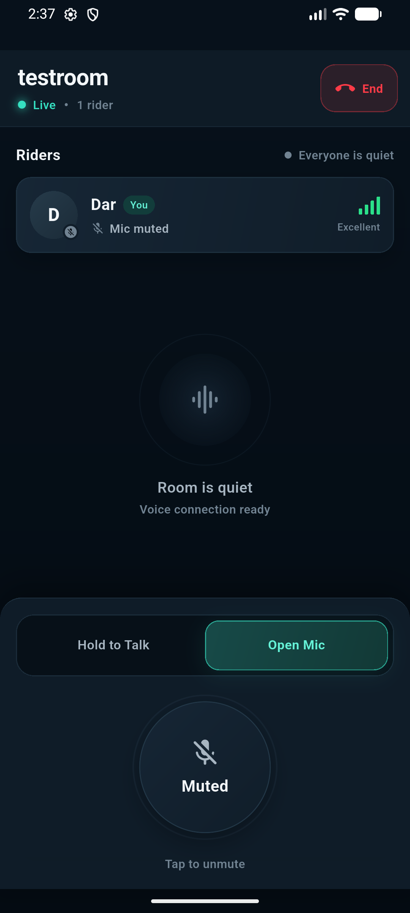

# RideLink

**Group voice para sa mga rider.** Isang push-to-talk / open-mic na intercom na tumatakbo sa mobile data sa halip na sa short-range na radyo — kaya walang limitasyon sa layo hangga't may signal.

> **Status: Prototype 01.** Gumagana at nasusubukan na sa totoong byahe, pero hindi pa handa sa publiko — tignan ang [Mga kilalang limitasyon](#mga-kilalang-limitasyon).

<table>
  <tr>
    <td width="25%"></td>
    <td width="25%"></td>
    <td width="25%"></td>
    <td width="25%"></td>
  </tr>
  <tr>
    <td align="center"><sub>Connect</sub></td>
    <td align="center"><sub>Tahimik</sub></td>
    <td align="center"><sub>On air</sub></td>
    <td align="center"><sub>Naka-mute</sub></td>
  </tr>
</table>

---

## Ano ang ginagawa nito

- **Group voice room** — sabay-sabay na usapan, hindi one-to-one
- **Dalawang mode** — hold-to-talk (mic bukas habang pinipindot) at open mic (tuloy-tuloy)
- **Bluetooth headset routing** — dumadaan sa helmet headset, hindi sa loudspeaker
- **Tuloy sa background** — foreground service para hindi maputol kapag naka-lock ang screen o nasa Maps
- **Live na status** — kung sino ang nagsasalita, sino ang naka-mute, at gaano kalakas ang signal ng bawat isa

## Disenyo

Ang UI ay ginawa para sa isang taong **naka-helmet, may gloves, at hindi puwedeng tumitig sa screen.**

**Ang kulay ay may kahulugan, hindi dekorasyon.** Isa lang ang tuntunin at hindi ito nagbabago kahit saang screen:

| Kulay | Kahulugan |
|---|---|
| 🟦 Teal | Konektado, handang magsalita, o aktibong nagta-transmit |
| 🔴 Pula | End call, disconnected, at ibang danger state |
| ⚪ Gray | Tahimik, naka-mute, o hindi aktibong control |

Kapag **matingkad na teal at may pulse ring ang microphone button, nagta-transmit ka.** Kapag neutral gray, tahimik o naka-mute ang mic. Hindi mo kailangang basahin ang teksto para malaman ang kasalukuyang state.

Ang interface ay gumagamit ng deep navy surfaces, malinaw na typography, malalaking touch target, at restrained technical details para madaling gamitin habang naka-motor nang hindi nagmumukhang gaming o hacker UI.

Nasa [`lib/theme.dart`](lib/theme.dart) ang lahat ng token; nasa [`lib/widgets.dart`](lib/widgets.dart) ang mga bahagi.

## Estruktura

```
lib/
  main.dart      Dalawang screen (Connect, Room) at ang voice logic
  theme.dart     Design tokens — kulay, type, spacing
  widgets.dart   Reusable UI components — fields, meters, mode switch, PTT button
test/
  widget_test.dart
docs/screenshots/
```

## Pagpapatakbo

Kailangan: Flutter 3.47+ at isang [LiveKit Cloud](https://cloud.livekit.io) project.

```bash
flutter pub get
flutter run
```

Sa Connect screen, ilagay ang **Sandbox ID** mula sa LiveKit dashboard mo, isang **room name** (dapat pareho sa lahat ng phone), at isang **callsign** (dapat magkaiba bawat phone).

Para hindi na ito i-type kada bukas, gumawa ng lokal na config — naka-gitignore ito, kaya hindi napupunta sa repo ang Sandbox ID:

```bash
cp dev.example.json dev.json     # tapos punan ang Sandbox ID mo
flutter run --dart-define-from-file=dev.json
```

Sinasadyang wala sa source ang Sandbox ID. Sinumang may hawak nito ay makakasali sa kahit anong room mo o makakaubos ng quota mo — walang authentication ang sandbox token server.

### Paggawa ng APK

```bash
flutter build apk --release              # universal, ~85 MB
flutter build apk --release --split-per-abi   # bawat ABI, ~22-35 MB
```

Ang universal ang mas madali kung ipapamigay sa iba't ibang phone. **Wag maghalo** ng universal at split sa iisang grupo — magkaiba ang `versionCode` nila, at ituturing ng Android na downgrade ang paglipat.

Ang release build ay pinipirmahan pa rin ng **debug key** — pang-test lang ito, hindi pang-Play Store. Kapag lumipat sa tunay na keystore, kailangang mag-uninstall muna ang lahat bago mag-install ulit.

## Mga kilalang limitasyon

Ito ang mga totoong hadlang, hindi mga maliliit na bug.

**Hindi mahawakan ang phone habang nagmamaneho.** Ang hold-to-talk ay nangangailangan ng paghawak sa screen — imposible habang may hawak na manibela. Ang tamang solusyon ay ang **media button ng Bluetooth helmet headset** (via MediaSession, gumagana kahit patay ang screen) o isang handlebar remote. Hanggang magawa yun, ang open mic ang tanging praktikal na mode habang umaandar.

**Deprecated na ang LiveKit Sandbox.** Ang [dokumentasyon](https://docs.livekit.io/home/cloud/sandbox/) mismo ang nagsasabi na *"some functionality may already be removed or disabled."* Ang buong pagkakakonekta ng app ay nakasandal dito. Ang kapalit ay isang sariling token endpoint — kailangan din ito para sa seguridad at para sa self-hosting.

**Walang authentication.** Ang sandbox token server ay nagbibigay ng token sa kahit sino: *"any frontend app can request a token with any permissions and no restrictions."* Sinumang may Sandbox ID ay makakasali sa kahit anong room.

**Mataas ang bitrate para sa layunin.** Hindi naka-set ang `encoding`, kaya `presetMusic` (48 kbps) ang default, at doble pa dahil sa RED. Sa Bluetooth helmet headset na 8–16 kHz lang ang SCO link, hindi naman naririnig ang dagdag na detalye. Ang `presetSpeech` (24 kbps) ay halos kalahati ang data nang walang mararamdamang pagkakaiba.

**Nauubos ang quota habang tahimik.** Ang LiveKit ay bumibilang ng **oras na nakakonekta**, hindi ng oras na may nagsasalita. Isang taong nakalimutang mag-end call ay patuloy na kumakain ng quota ng buong grupo.

**Default pa ang app icon.** Flutter logo pa rin ang lalabas sa launcher.

## Susunod

- [ ] Sariling token endpoint (Laravel) — papalit sa deprecated na sandbox, nagdadala ng authentication
- [ ] Media button ng Bluetooth headset para sa hands-free na PTT
- [ ] `presetSpeech` na encoding
- [ ] Auto-disconnect kapag matagal nang tahimik, para hindi masayang ang quota
- [ ] Sariling app icon
- [ ] Self-hosted LiveKit server kapag lumaki na ang gamit

## Ginamit

[Flutter](https://flutter.dev) · [LiveKit](https://livekit.io) (WebRTC SFU) · [flutter_webrtc](https://pub.dev/packages/flutter_webrtc) · [permission_handler](https://pub.dev/packages/permission_handler) · [flutter_background](https://pub.dev/packages/flutter_background)
